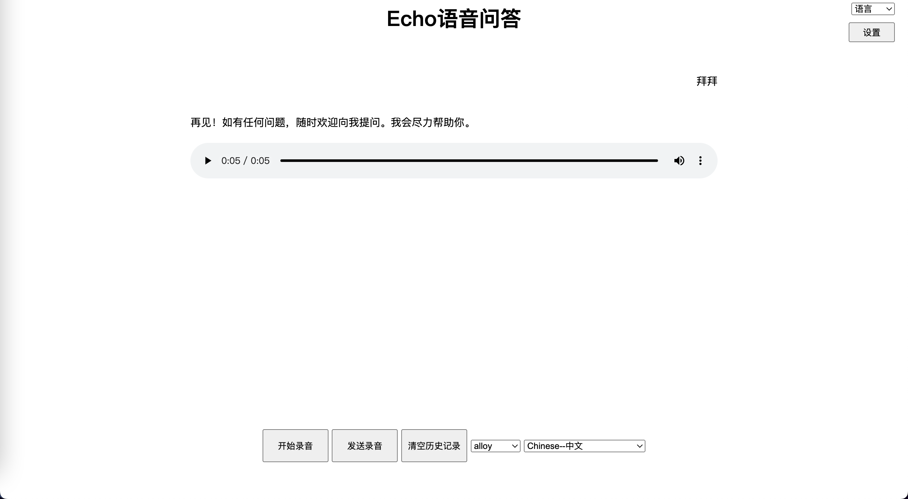

[中文](./README.md)
# Project Name

Echo Voice Q&A

## Project Description

A simple web page for openai voice dialogue, using JavaScript and HTML to make requests to the openai API for voice conversations.·

- Project Background and Motivation: The original intention was to implement basic dialogue functionality, so I didn't use react/vue. However, as the functionality increased, the code became bloated...
- Technology Stack and Dependencies: HTML, CSS, JavaScript

## Screenshots

### Installation

Provide the steps and dependencies required to install the project. For example:

- Simply host it on a server.
- To access the voice API, you need a domain with HTTPS.